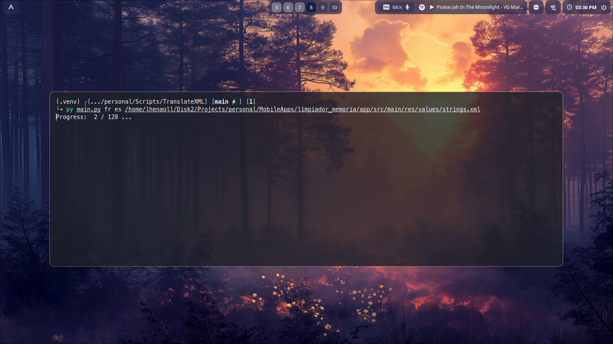

# Translate XML string file

Translate you XML to other language

## Requirements

- Python 3
- Pip

## Installation

- Clone this repo or download the zip
- Move to folder `cd TranslateXML`
- If you want to use `virtual env` for python, create it. _(Optional)_
- Install pip requirements `pip install -r requirements.txt`
- Execute `pyhton main.py [to_language] [from_language] [path_file]`

The result file is create in this same folder with `translated.xml` name.

## Important

In many languages is common the apostrophe use `'`.

**Remember** escape in your xml file the apostrophe with `\`, when the problem or error persist is necessary remove this item from your `string.xml` and create it with the Android Studio Editor, it will code the characters in a way that does not produce an error.

Visit me! [Leonardo Henao](https://leonardohenao.com)

